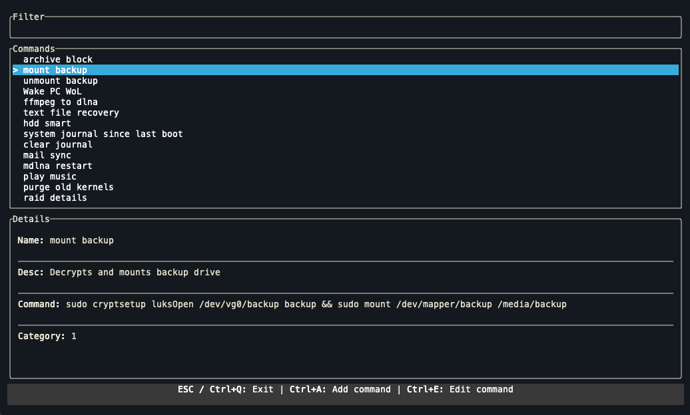

# BASH-COMMANDER

## Bash Command Saver TUI

A simple terminal user interface (TUI) application built in Rust to manage and execute bash commands. This tool allows you to save frequently used bash commands with names, descriptions, and categories, and then easily access and execute them from a searchable list within your terminal.

## Getting Started

To run this application, you will need to have Rust and Cargo installed on your system. If you don't have them installed, you can follow the instructions on the official Rust website.

1. Clone the repository
2. Build the application: `cargo build --release`
3. After building, you can run the executable directly: `./target/release/bash_commander`

## Usage

- **Running the Application**: Launch the application from your terminal.
- **Navigating the List**: Use the Up and Down arrow keys to navigate through the list of saved commands.
- **Filtering Commands**: Type in the filter input box to search for commands. The list will be updated in real-time to show commands matching your filter.
- **Adding a New Command**: Press a to open the "Add Command" popup. Fill in the Name, Description, Command fields and press Enter to save.
- **Editing a Command**: Select a command from the list and press ctrl+e to open the "Edit Command" popup with the command details pre-filled. Modify the fields and press Enter to save changes.
- **Executing a Command**: Select a command from the list and press Enter.
- **Exiting the Application**: Press ESC or Ctrl+q to quit the application.

## License

This project is open-source and available under the MIT License. See the LICENSE file for more details.
